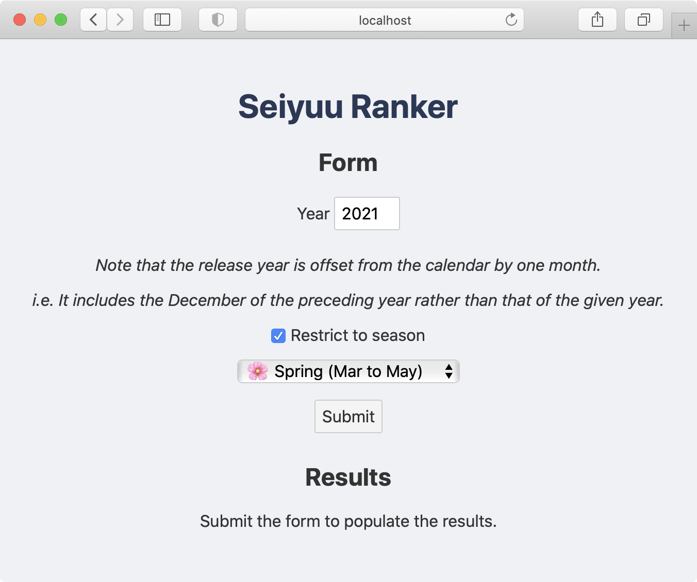
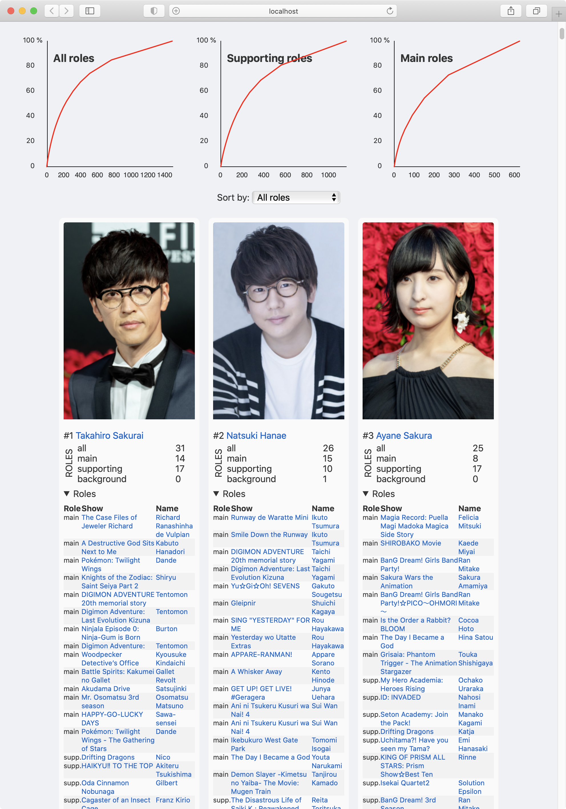

# Seiyuu ranker

A form to determine which seiyuus (voice actors/actresses) were the most prolific in a given year or season. It gets all its information by querying the [AniList](https://anilist.co) database.

## Example

<table>
    <tbody>
        <tr>
            <td align="center" valign="middle">
                
            </td>
            <td align="center" valign="middle">
                
            </td>
        </tr>
        <tr>
            <td align="center" valign="middle">Form</td>
            <td align="center" valign="middle">Example output for whole of 2020</td>
        </tr>
    </tbody>
</table>

## Get started

Install the dependencies...

```bash
cd seiyuu-ranker
npm install
```

...then start [Rollup](https://rollupjs.org):

```bash
npm run dev
```

Navigate to [localhost:5000](http://localhost:5000). You should see your app running. Edit a component file in `src`, save it, and reload the page to see your changes.

By default, the server will only respond to requests from localhost. To allow connections from other computers, edit the `sirv` commands in package.json to include the option `--host 0.0.0.0`.

If you're using [Visual Studio Code](https://code.visualstudio.com/) we recommend installing the official extension [Svelte for VS Code](https://marketplace.visualstudio.com/items?itemName=svelte.svelte-vscode). If you are using other editors you may need to install a plugin in order to get syntax highlighting and intellisense.

## Usage

Just fill in the form and submit it! For whole-year queries, you will likely have to wait an extra minute for all the requests to complete due to [AniList's rate-limiting](https://anilist.gitbook.io/anilist-apiv2-docs/overview/rate-limiting). But don't worry; the app will tell you at the time if it does have to wait due to rate limiting.

Submitting this form executes a fair few queries; it's easy to go over 100, for example. So as not to pummel the AniList DB too hard, I run requests back-to-back and use mock data where possible during development (see the `.json` files in the `public` folder, which I don't guarantee to all follow the latest schema).

* You can switch to using existing mock data by editing `src/App.svelte` to switch the `mock` param to `true`.
* You can print out mock data of your own by editing `src/App.svelte` to switch the `printResponse` param to `true`. This will cause the response data to be written into an element at the start of the results section.